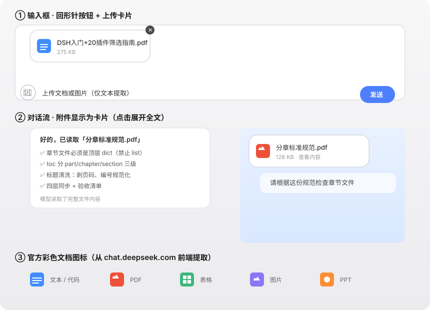

# dsh-ds-attach

**DeepSeek Chat（chat.deepseek.com）同款附件渲染样式** —— 上传按钮、文件卡片、图标、消息内附件展示，全部一比一复刻官方前端（图标与样式直接提取自 chat.deepseek.com 前端 bundle）。DeepSeek Harness 插件（dual-face bundle）。



## 功能（与 chat.deepseek.com 一致）

- **回形针上传按钮**：输入框工具栏左侧，DSH 官方 `IconPaperclipOutline16` 图标，点击选择任意文档/图片（多选），tooltip「上传文档或图片（仅文本提取）」
- **拖拽上传**：非图片文件拖到页面任意位置即上传
- **DS 风格文件卡片**：240×64px、圆角 16px、1px 边框——左侧 **28×28 官方彩色文档图标**（PDF 红/表格绿/图片紫/PPT 橙/文本蓝，从 chat.deepseek.com 前端 bundle 扒出的精确 SVG）、文件名（14px/500）+ 状态副行（12px）、右上角 18px 圆形删除按钮，多文件横排
- **状态流转**：上传中 → 解析中 → 完成 / 未提取到文本 / 上传失败（与官方「Uploading/Parsing/No text extracted」对应）
- **文本提取**（与官方一致，服务端解析）：
  - **PDF** → pdfjs-dist 提取文本
  - **DOCX** → mammoth 提取文本
  - **XLSX** → xlsx 读取单元格（前 5 个 sheet）
  - **TXT/MD/代码** → 直接读文本
  - 按 token 预算截断（6 万字符）
- **发送即清空**：卡片随消息发送后，输入框附件区自动清空（DS chat 行为）
- **消息里显示卡片**：自定义 user 节点渲染器（priority -1 接管），对话流中附件显示为**真正的文件卡片**（文件名 + 彩色图标 + 大小，点击展开全文），而非原始长文本；普通消息保持原样浅蓝气泡
- **图片分流**：图片自动走 DSH 原生视觉附件管线
- **模型可读**：提取文本随消息结构化注入（`【附件】名\n【文件大小】N\n【文件内容】…【文件内容结束】`），模型读到完整内容

## 安装

```sh
# 从 GitHub
dsh plugin --profile web add github:wqx-txdsyl/dsh-ds-attach

# 或本地路径
dsh plugin --profile web add <本目录绝对路径>
```

重启 `dsh web` 生效。

## 依赖

`pdfjs-dist` / `mammoth` / `xlsx`（纯 JS，无原生编译）。安装插件时若提示 allowBuilds，按提示添加即可（这些库无编译脚本，通常无需）。

## 说明

- **host 半**：`/ds-attach/upload`（base64 接收 + 落盘 + 文本提取）、`/ds-attach/file`（回读）、`/ds-attach/meta`（元信息）
- **client 半**：回形针按钮 + 拖拽 + 卡片 UI + user 消息渲染器
- 文件存于 `$DSH_HOME/ds-attach/<sessionId>/`，会话隔离，路径穿越防护
- 扫描版 PDF（无文字层）显示「未提取到文本」（与官方一致，官方也不做 OCR）
- user 渲染器接管所有用户消息渲染（与产品样式一致），保证普通消息显示不变

## License

MIT
